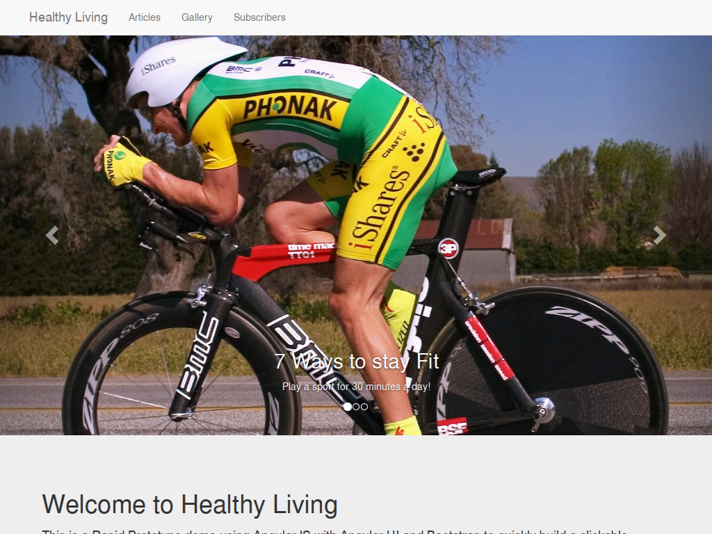
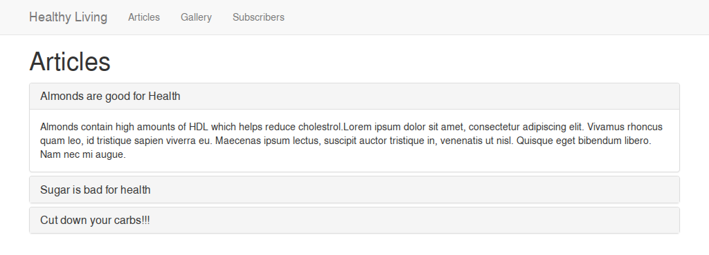
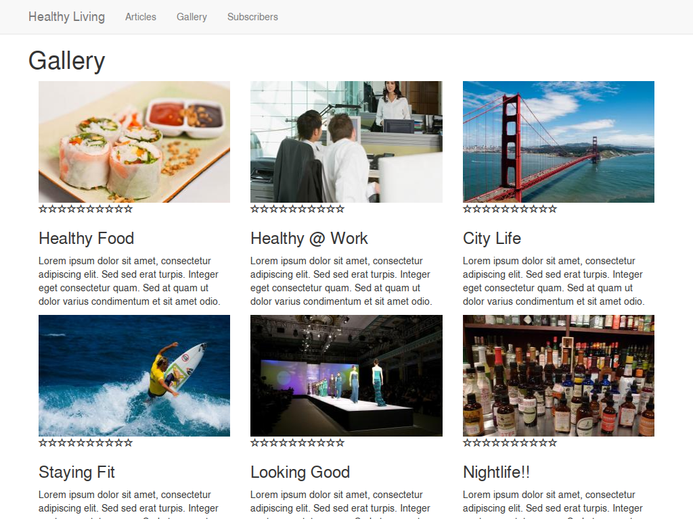
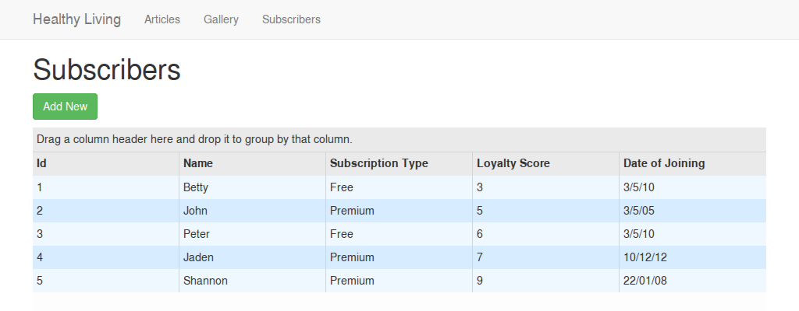

# Health Living

Live at: https://bionikspoon-healthy-living.herokuapp.com/

*(Heroku free tier, give it a second to wake up)*

## The project

The goal of this exercise was to rapidly build a clickable prototype in a short amount of time. And proceed to spend a much greater amount of time learning why Heroku can't serve it ¯\\\_(ツ)\_/¯

It uses angular with bootstrap, angular-bootstrap, and ng-grid.

The logic, assets, and content is mostly mocked to appear like it's working, but it does not--by design.

## Screens

